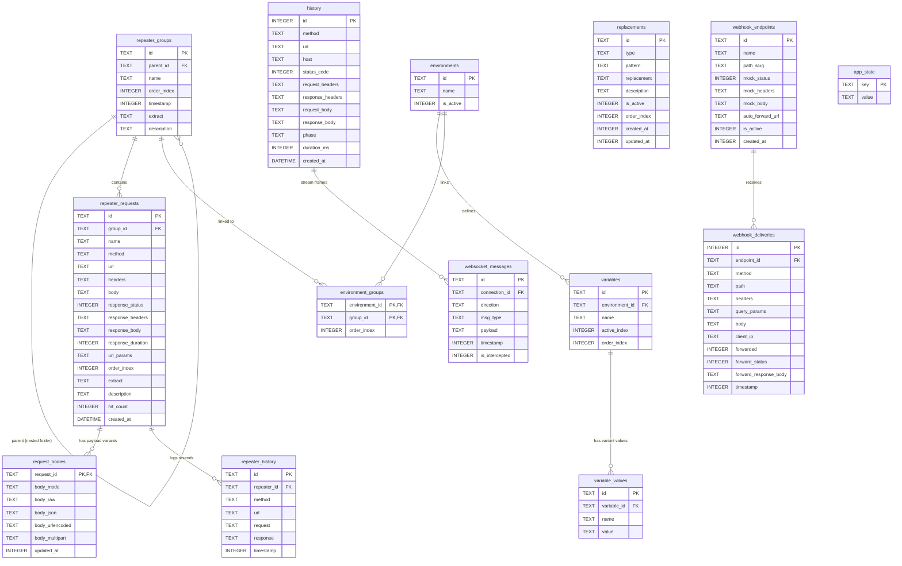

# Database Schema Documentation (`mitm.db`)

This document describes the complete SQLite database schema for `mitm.db`.

---

## 📊 Visual Entity-Relationship Diagram (Mermaid)



---

## 🛠 DBML Syntax (for [dbdiagram.io](https://dbdiagram.io))

Copy and paste the code block below into [dbdiagram.io](https://dbdiagram.io):

```dbml
// Database Schema: mitm.db (SQLite)

Table history {
  id integer [pk]
  method varchar
  url varchar
  host varchar
  status_code int
  request_headers text
  response_headers text
  request_body text
  response_body text
  phase varchar
  duration_ms int
  created_at datetime [default: `CURRENT_TIMESTAMP`]
}

Table repeater_groups {
  id varchar [pk]
  parent_id varchar [ref: > repeater_groups.id]
  name varchar
  order_index int [default: 0]
  timestamp int
  extract text
  description text
}

Table repeater_requests {
  id varchar [pk]
  group_id varchar [ref: > repeater_groups.id]
  name varchar
  method varchar
  url varchar
  headers text
  body text
  response_status int
  response_headers text
  response_body text
  response_duration int
  url_params text
  order_index int [default: 0]
  extract text
  description text
  hit_count int [default: 0]
  created_at datetime [default: `CURRENT_TIMESTAMP`]
}

Table request_bodies {
  request_id varchar [pk, ref: - repeater_requests.id]
  body_mode varchar [default: 'raw']
  body_raw text
  body_json text
  body_urlencoded text
  body_multipart text
  updated_at int
}

Table repeater_history {
  id varchar [pk]
  repeater_id varchar [ref: > repeater_requests.id]
  method varchar
  url varchar
  request text
  response text
  timestamp int
}

Table environments {
  id varchar [pk]
  name varchar
  is_active int [default: 0]
}

Table variables {
  id varchar [pk]
  environment_id varchar [ref: > environments.id]
  name varchar
  active_index int [default: 0]
  order_index int [default: 0]
}

Table variable_values {
  id varchar [pk]
  variable_id varchar [ref: > variables.id]
  name varchar
  value text
}

Table environment_groups {
  environment_id varchar [ref: > environments.id]
  group_id varchar [ref: > repeater_groups.id]
  order_index int [default: 0]

  Indexes {
    (environment_id, group_id) [pk]
  }
}

Table replacements {
  id varchar [pk]
  type varchar [not null]
  pattern varchar [not null]
  replacement varchar [not null]
  description text
  is_active int [default: 1]
  order_index int [default: 0]
  created_at int
  updated_at int
}

Table websocket_messages {
  id varchar [pk]
  connection_id varchar [ref: > history.id]
  direction varchar [not null]
  msg_type varchar [not null]
  payload text [not null]
  timestamp int [not null]
  is_intercepted int [default: 0]
}

Table webhook_endpoints {
  id varchar [pk]
  name varchar [not null]
  path_slug varchar [not null, unique]
  mock_status int [default: 200]
  mock_headers text [default: '{}']
  mock_body text [default: '{"status":"received"}']
  auto_forward_url text
  is_active int [default: 1]
  created_at int
}

Table webhook_deliveries {
  id integer [pk, increment]
  endpoint_id varchar [ref: > webhook_endpoints.id]
  method varchar [not null]
  path varchar [not null]
  headers text [not null]
  query_params text [default: '{}']
  body text [default: '']
  client_ip varchar
  forwarded int [default: 0]
  forward_status int
  forward_response_body text
  timestamp int [not null]
}

Table app_state {
  key varchar [pk]
  value text
}
```

---

## 📋 Table Descriptions & Details

### 1. `history`
Captured HTTP/1.1 & HTTP/2 MITM traffic log entries.
- **id**: Integer primary key, assigned in order by the proxy
- **method**: HTTP verb (`GET`, `POST`, `PUT`, `DELETE`, etc.)
- **url**: Complete target URL string
- **host**: Domain or IP address
- **status_code**: Response status code integer (e.g. `200`, `404`)
- **request_headers**: JSON array of `{ key, value }` pairs
- **response_headers**: JSON array of `{ key, value }` pairs
- **request_body**: Raw request payload text
- **response_body**: Raw response payload text
- **duration_ms**: Latency in milliseconds

### 2. `repeater_groups`
API Collection folders with nested hierarchy support.
- **id**: Primary Key
- **parent_id**: Self-referencing FK for nested sub-folders
- **name**: Folder title
- **extract**: Auto-extract JSON/Regex rules

### 3. `repeater_requests` & `request_bodies`
Saved Repeater API requests and multi-variant payloads (`raw`, `json`, `urlencoded`, `multipart`).

### 4. `environments` & `variables` & `variable_values`
Workspace environment definitions and scoped `{{variable_name}}` macro values.

### 5. `websocket_messages`
Captured WebSocket frames linked to connection IDs in `history`.

### 6. `webhook_endpoints` & `webhook_deliveries`
Embedded local webhook listener server endpoints and incoming payloads.
