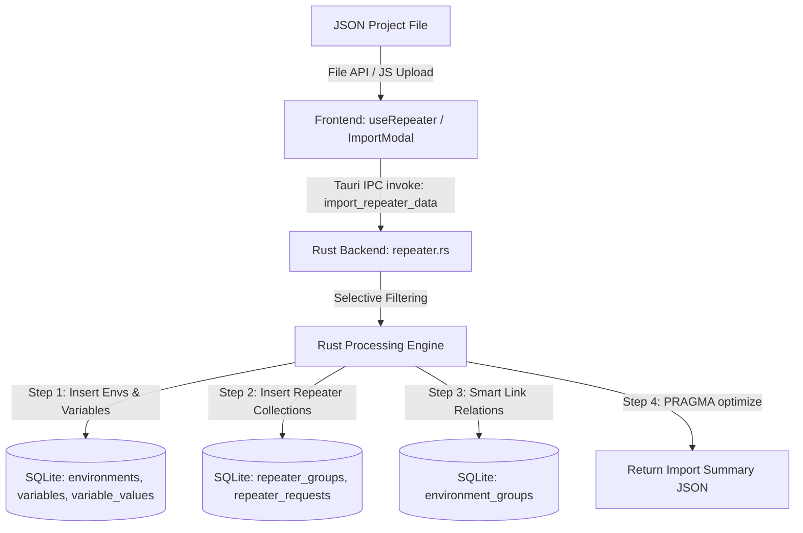

# Import Project from JSON Specification

This document provides a technical specification and operational guide for the **Import Project from JSON** functionality in MITM Rust. The backend logic is implemented in `src-tauri/src/repeater.rs`.

---

## Architecture Overview

The import system allows importing complete projects—including environments, variables, repeater request collections (groups), and endpoint targets—from a single structured JSON file into the local SQLite database.



---

## Best Practices: Full Base URL Variable Templating (`{{url}}` / `{{host}}`)

To ensure clean separation between request definitions and environment configurations, **always store full URLs including the protocol (e.g. `https://api.example.com` or `http://localhost:8080`)** in environment variable values instead of omitting the protocol (e.g. just `example.com`), since testing often occurs across both secure production endpoints (`https://`) and local development servers (`http://localhost`).

### Benefits of Full Base URL (`https://...` or `http://...`) Templating:
1. **HTTP vs HTTPS Protocol Flexibility**: Seamlessly test on local HTTP servers (e.g. `http://localhost:8080` or `http://127.0.0.1:3000`) without breaking requests that assume `https://`.
2. **Dynamic Environment Switching**: Toggle between *Development*, *Staging*, *Production*, and *Localhost* environments without changing request definitions. The `{{url}}` or `{{host}}` placeholder dynamically resolves to the complete protocol, host, and port configured in the active environment.
3. **Clean Request Specifications**: Endpoint definitions remain clean and relative (e.g. `{{host}}/v1/auth/login`), while protocols, domains, and ports are centrally managed in environment variables.

### Pattern Examples:
- **Full Base URL Variable (Recommended)**: `"url": "{{url}}"` (where `url` = `https://api.example.com`, `https://dev-api.example.com`, or `http://localhost:8080`)
- **Host + Base Path Variable**: `"url": "{{host}}/v1"` (where `host` = `https://api.example.com` or `http://localhost:3000`)
- **Complete Endpoint with Variables**: `"url": "{{host}}/api/v1/users/{{userId}}"`

---

## Rust Struct & Data Contracts

The Rust backend in `src-tauri/src/repeater.rs` defines the payload contract using `serde::Deserialize`:

```rust
#[derive(Debug, Deserialize, Serialize)]
pub struct ImportRepeaterData {
    pub name: Option<String>,
    pub url: Option<String>,
    pub header: Option<serde_json::Value>,
    pub placeholders: Option<serde_json::Value>,
    pub all_environments: Option<Vec<serde_json::Value>>,
    pub all_variables: Option<Vec<serde_json::Value>>,
    pub test_cases: Option<Vec<serde_json::Value>>,
    pub import_environments: Option<Vec<String>>,
    pub import_groups: Option<Vec<String>>,
    pub link_to_environment: Option<String>,
    pub link_to_environments: Option<Vec<String>>,
    pub smart_link: Option<bool>,
}
```

---

## JSON Format Specification

### Root Schema

| Field | Type | Required | Description |
| :--- | :--- | :--- | :--- |
| `name` | String | No | Project display name |
| `url` | String | No | Global base URL fallback (Best practice: `"https://{{url}}"` or `"https://{{host}}"`) |
| `header` | Object | No | Key-value dictionary of global HTTP headers |
| `placeholders` | Object | No | Key-value dictionary for simple variable fallbacks |
| `all_environments` | Array | No | List of environment definitions |
| `all_variables` | Array | No | List of environment variable definitions |
| `test_cases` | Array | No | List of repeater groups (collections) and request targets |
| `import_environments` | Array | No | Array of environment IDs or names selected for import |
| `import_groups` | Array | No | Array of group names selected for import |
| `link_to_environment` | String | No | Single target environment ID to link imported groups to (legacy) |
| `link_to_environments` | Array | No | Target environment IDs to link imported groups to |
| `smart_link` | Boolean | No | If `true`, automatically links imported groups to newly imported environments |

---

### Nested Schema Definitions

#### 1. `all_environments` Item
```json
{
  "id": "env_dev_001",
  "name": "Development"
}
```

#### 2. `all_variables` Item (Host & Token Variables)
```json
{
  "environmentId": "env_dev_001",
  "name": "host",
  "activeIndex": 0,
  "values": [
    {
      "name": "Dev Server",
      "value": "https://dev-api.example.com"
    },
    {
      "name": "Localhost",
      "value": "http://localhost:8080"
    }
  ]
}
```

#### 3. `test_cases` Item (Repeater Group with `{{host}}` and Markdown `description`)
```json
{
  "name": "Authentication API",
  "url": "{{host}}/v1",
  "description": "# Authentication API Collection\n\nThis collection contains all endpoints related to user authentication, token extraction, and session management.\n\n> [!NOTE]\n> OAuth 2.0 access tokens extracted here are stored in the active environment variable `{{token}}`.",
  "target": [
    {
      "name": "Login Request",
      "method": "POST",
      "endpoint": "/auth/login",
      "description": "### User Login Endpoint\n\nAuthenticate credentials and extract the Bearer token.\n\n#### Parameters\n| Field | Type | Description |\n| :--- | :--- | :--- |\n| `username` | String | User email or username |\n| `password` | String | Account password |\n\n> [!TIP]\n> Successful response (200 OK) automatically extracts `data.access_token` into `{{token}}`.",
      "params": {
        "grant_type": "password"
      },
      "header": {
        "Content-Type": "application/json",
        "Authorization": null
      },
      "body": "{\"username\":\"admin\",\"password\":\"secret\"}",
      "extract": {
        "token": "data.access_token"
      }
    }
  ]
}
```

##### Markdown `description` Format Rules:
- Both **Collections** (`test_cases` items) and **Individual Requests** (`target` items) support an optional `description` string.
- The `description` field accepts full **GitHub Flavored Markdown (GFM)**:
  - Headers (`#`, `##`, `###`)
  - Code Blocks (` ```json ... ``` `)
  - Alert Callouts (`> [!NOTE]`, `> [!TIP]`, `> [!WARNING]`, `> [!IMPORTANT]`)
  - Tables (`| col | col |`)
  - Lists (`- item`, `1. item`)
  - Inline Code (`` `variable` ``) and Bold/Italic formatting.
- When imported, `description` strings are automatically stored into SQLite (`repeater_groups.description` and `repeater_requests.description`) and rendered natively in the UI using `react-markdown` and `remark-gfm`.

#### 4. Base64 File Payloads (`application/json` & `multipart/form-data`)

MITM Rust supports embedding binary files directly within Repeater request bodies as Base64 strings.

##### A. `application/json` Base64 File Embedding
Files can be attached directly into JSON request payloads as Base64 Data URIs (`data:<mime>;base64,<payload>`). The UI JSON tree editor includes a `FILE` type option that converts local disk files to Base64 strings automatically.

```json
{
  "name": "JSON Base64 File Upload",
  "method": "POST",
  "endpoint": "/v1/documents/upload",
  "header": {
    "Content-Type": "application/json"
  },
  "body": "{\"documentName\":\"invoice.pdf\",\"fileData\":\"data:application/pdf;base64,JVBERi0xLjQK...\"}"
}
```

##### B. `multipart/form-data` Base64 Form Uploads
For multipart form requests, Base64 files use the `__form_data` array structure with `"type": "base64"`. The Rust execution engine (`src-tauri/src/repeater_execute.rs`) decodes the Base64 payload and constructs valid multipart HTTP boundaries automatically upon sending.

```json
{
  "name": "Multipart Base64 Form Upload",
  "method": "POST",
  "endpoint": "/files/upload",
  "header": {
    "Content-Type": "multipart/form-data"
  },
  "body": "{\"__form_data\":[{\"k\":\"file\",\"v\":\"data:application/pdf;base64,JVBERi0xLjQK...\",\"type\":\"base64\",\"fileName\":\"invoice.pdf\",\"contentType\":\"application/pdf\"}]}"
}
```

---

## Backend Processing Engine (`src-tauri/src/repeater.rs`)

### 1. Environments & Variables Ingestion

1. **Selective Filter**: An environment from `all_environments` is processed only if `import_environments` is empty/omitted OR contains the environment's `id` or `name`.
2. **Environment Insertion**:
   - A new UUID is generated for the environment in the database.
   - Inserted into `environments(id, name, is_active)` with `is_active = 0`.
3. **Variable Ingestion**:
   - Matches `all_variables` entries where `environmentId` equals the source environment `id`.
   - Generates new UUID for `variables(id, environment_id, name, active_index)`.
   - Iterates through `values` and inserts into `variable_values(id, variable_id, name, value)`.

### 2. Repeater Group & Request Ingestion

1. **Selective Filter**: A group from `test_cases` is imported only if `import_groups` is empty/omitted OR contains the group's `name`.
2. **Group Insertion**:
   - Generates new UUID for `repeater_groups(id, name, order_index)`.
3. **Environment Linking**:
   - Links group to environment IDs specified in `link_to_environments` / `link_to_environment`.
   - If `smart_link: true`, automatically adds links to newly created environment IDs.
   - Inserts records into `environment_groups(group_id, environment_id)`.
4. **URL Resolution Logic**:
   - Base URL precedence: `group.url` -> `global.url` -> `""`.
   - Concatenates `base_url` + `request.endpoint`.
   - Formats `params` as key-value query parameters (`?key1=val1&key2=val2`) and appends to URL.
   - Preserves `{{host}}` and `{{url}}` variable placeholders for runtime substitution by the active environment context.
5. **Header Resolution Logic**:
   - Starts with global `header` map.
   - Overrides or adds keys from request-level `header`.
   - If request header key maps to `null`, the header is **deleted/removed**.
6. **Request Insertion**:
   - Inserts into `repeater_requests(id, name, group_id, method, url, headers, body, extract, order_index)`.

---

## Returned Response Contract

On success, `import_repeater_data` returns:

```json
{
  "success": true,
  "imported": {
    "environments": 2,
    "variables": 5,
    "groups": 3,
    "requests": 12
  }
}
```

---

## Complete Example JSON File (Best Practice Template)

Below is a production-grade sample project JSON file demonstrating best practices with `https://{{host}}` and `https://{{url}}` variable templating:

```json
{
  "name": "E-Commerce API Suite",
  "url": "https://{{host}}",
  "header": {
    "Accept": "application/json",
    "X-Client-ID": "mitm-desktop-app"
  },
  "all_environments": [
    {
      "id": "env_dev_001",
      "name": "Development"
    },
    {
      "id": "env_prod_001",
      "name": "Production"
    }
  ],
  "all_variables": [
    {
      "environmentId": "env_dev_001",
      "name": "host",
      "activeIndex": 0,
      "values": [
        {
          "name": "Dev Server",
          "value": "https://dev.api.store.com"
        },
        {
          "name": "Localhost",
          "value": "http://localhost:3000"
        }
      ]
    },
    {
      "environmentId": "env_dev_001",
      "name": "token",
      "activeIndex": 0,
      "values": [
        {
          "name": "Dev Token",
          "value": "dev_bearer_token_123"
        }
      ]
    },
    {
      "environmentId": "env_prod_001",
      "name": "host",
      "activeIndex": 0,
      "values": [
        {
          "name": "Production Gateway",
          "value": "https://api.store.com"
        }
      ]
    },
    {
      "environmentId": "env_prod_001",
      "name": "token",
      "activeIndex": 0,
      "values": [
        {
          "name": "Prod Token",
          "value": "prod_bearer_token_999"
        }
      ]
    }
  ],
  "test_cases": [
    {
      "name": "User Service",
      "url": "https://{{host}}/v1",
      "target": [
        {
          "name": "Get Profile",
          "method": "GET",
          "endpoint": "/profile",
          "params": {
            "include_meta": "true"
          },
          "header": {
            "Authorization": "Bearer {{token}}"
          },
          "body": "",
          "extract": {
            "userId": "user.id"
          }
        }
      ]
    },
    {
      "name": "Payment Gateway",
      "url": "https://{{url}}",
      "target": [
        {
          "name": "Process Payment",
          "method": "POST",
          "endpoint": "/checkout/pay",
          "header": {
            "Authorization": "Bearer {{token}}",
            "Content-Type": "application/json"
          },
          "body": "{\"amount\": 99.99, \"currency\": \"USD\"}",
          "extract": {
            "transactionId": "data.txn_id"
          }
        }
      ]
    }
  ]
}
```

---

## Multi-Variant Body Storage & Format Modes (`request_bodies` Table)

Starting with Database Migration Version 8, request bodies are stored in a dedicated, non-destructive **`request_bodies`** table. This ensures that switching between `raw`, `json`, `x-www-form-urlencoded`, and `form-data` modes in the editor does not overwrite or destroy data in other formats.

| Entity | DB Table | Key Columns | Description |
| :--- | :--- | :--- | :--- |
| Environment | `environments` | `id`, `name`, `is_active` | Saved environment definitions |
| Variable | `variables` | `id`, `environment_id`, `name`, `active_index` | Global variable definitions |
| Variable Value | `variable_values` | `id`, `variable_id`, `name`, `value` | Variant values per variable |
| Repeater Group | `repeater_groups` | `id`, `name`, `order_index`, `extract`, `description` | Endpoint collection containers |
| Repeater Request | `repeater_requests` | `id`, `name`, `group_id`, `method`, `url`, `headers`, `body`, `extract`, `description`, `response_duration`, `url_params` | Endpoint request definitions with persisted URL parameter toggles & latency |
| Multi-Variant Bodies | `request_bodies` | `request_id`, `body_mode`, `body_raw`, `body_json`, `body_urlencoded`, `body_multipart` | Dedicated format variant buffers per request |
| Group Environment Link | `environment_groups` | `group_id`, `environment_id` | Collection-to-environment links |

---

### Request Target Body & URL Parameter JSON Fields (Optional Specification)

| Field | Type | Description | Example |
| :--- | :--- | :--- | :--- |
| `body` | String | Main / Raw request body content | `"{\"key\": \"value\"}"` or `"k1=v1&k2=v2"` |
| `body_mode` | String | Active body mode: `"raw"`, `"json"`, `"urlencoded"`, or `"multipart"` | `"urlencoded"` |
| `body_json` | String | Dedicated JSON body representation | `"{\"amount\": 100}"` |
| `body_urlencoded` | String | Dedicated URL-encoded body string | `"grant_type=client_credentials&client_id={{client_id}}"` |
| `body_multipart` | String | Dedicated Multipart form data JSON structure with parameter toggles | `"{\"__form_data\": [{\"enabled\": true, \"k\": \"file\", \"v\": \"data:...\", \"type\": \"base64\"}]}"` |
| `url_params` | String | JSON string of URL query parameter entries with enable/disable toggles | `"[{\"id\":\"123\",\"k\":\"page\",\"v\":\"1\",\"enabled\":true},{\"id\":\"456\",\"k\":\"filter\",\"v\":\"abc\",\"enabled\":false}]"` |

#### Parameter & JSON Key ON / OFF Toggles

1. **URL Parameters (`url_params`), Multipart & URL-Encoded Form Data**:
   Each entry includes an optional `"enabled": true | false` property:
   - **`"enabled": true`**: Parameter is active and included when reconstructing URLs or executing HTTP requests.
   - **`"enabled": false`**: Parameter is disabled and excluded from the request URL/payload, but remains persisted in the editor table UI for quick testing.

2. **JSON Object Property Keys (`body_json` / `body`)**:
   - Object keys prefixed with `__disabled_` (e.g. `"__disabled_filter": "xxx"`) are rendered in the visual JSON tree editor as disabled properties (`[ ]` unchecked with strike-through styling).
   - Upon HTTP request execution, the backend automatically strips all `__disabled_` keys recursively so the server receives clean, valid JSON.

---

### Comprehensive Body Variant & Parameter Examples

#### 1. JSON Body with Disabled Property Keys (`body_mode: "json"`)
In `body_json` or `body`, prefixing any object property key with `__disabled_` renders it as an unchecked `[ ]` property in the UI tree editor, and automatically strips it upon sending:

```json
{
  "name": "Create Order with Disabled Filter",
  "method": "POST",
  "endpoint": "/api/v1/orders",
  "body_mode": "json",
  "body_json": "{\n  \"customer_id\": \"cust_123\",\n  \"amount\": 250.00,\n  \"__disabled_discount_code\": \"SUMMER50\",\n  \"items\": [\"item_a\", \"item_b\"]\n}",
  "header": {
    "Content-Type": "application/json"
  }
}
```

#### 2. Structured URL Parameters with Active & Disabled Toggles (`url_params`)
The `url_params` field stores the array of structured URL query parameters, preserving disabled parameters for quick testing without deleting them:

```json
{
  "name": "Search Products",
  "method": "GET",
  "endpoint": "/api/v1/products",
  "url_params": "[\n  {\"id\": \"p1\", \"k\": \"page\", \"v\": \"1\", \"enabled\": true},\n  {\"id\": \"p2\", \"k\": \"limit\", \"v\": \"20\", \"enabled\": true},\n  {\"id\": \"p3\", \"k\": \"category\", \"v\": \"electronics\", \"enabled\": false}\n]",
  "body_mode": "raw"
}
```
*Resulting executed URL:* `/api/v1/products?page=1&limit=20` (`category` is disabled and omitted).

#### 3. URL-Encoded Form Data (`body_mode: "urlencoded"`)
URL-encoded forms support dedicated `body_urlencoded` representation with parameter ON/OFF toggling:

```json
{
  "name": "OAuth 2.0 Client Credentials Token",
  "method": "POST",
  "endpoint": "/oauth/token",
  "body_mode": "urlencoded",
  "body_urlencoded": "grant_type=client_credentials&client_id={{client_id}}&client_secret={{client_secret}}",
  "header": {
    "Content-Type": "application/x-www-form-urlencoded"
  }
}
```

#### 4. Multipart Form Data with File & Disabled Controls (`body_mode: "multipart"`)
Multipart form payloads store `__form_data` arrays supporting text parameters, Base64 files, and `enabled: false` toggles:

```json
{
  "name": "Upload User Profile Avatar",
  "method": "POST",
  "endpoint": "/api/v1/profile/avatar",
  "body_mode": "multipart",
  "body_multipart": "{\n  \"__form_data\": [\n    {\n      \"enabled\": true,\n      \"k\": \"avatar\",\n      \"v\": \"data:image/png;base64,iVBORw0KGgoAAAANSUhEUgAA...\",\n      \"type\": \"base64\",\n      \"fileName\": \"profile.png\",\n      \"contentType\": \"image/png\"\n    },\n    {\n      \"enabled\": true,\n      \"k\": \"userId\",\n      \"v\": \"user_999\",\n      \"type\": \"text\"\n    },\n    {\n      \"enabled\": false,\n      \"k\": \"debug_mode\",\n      \"v\": \"true\",\n      \"type\": \"text\"\n    }\n  ]\n}",
  "header": {
    "Content-Type": "multipart/form-data"
  }
}
```
