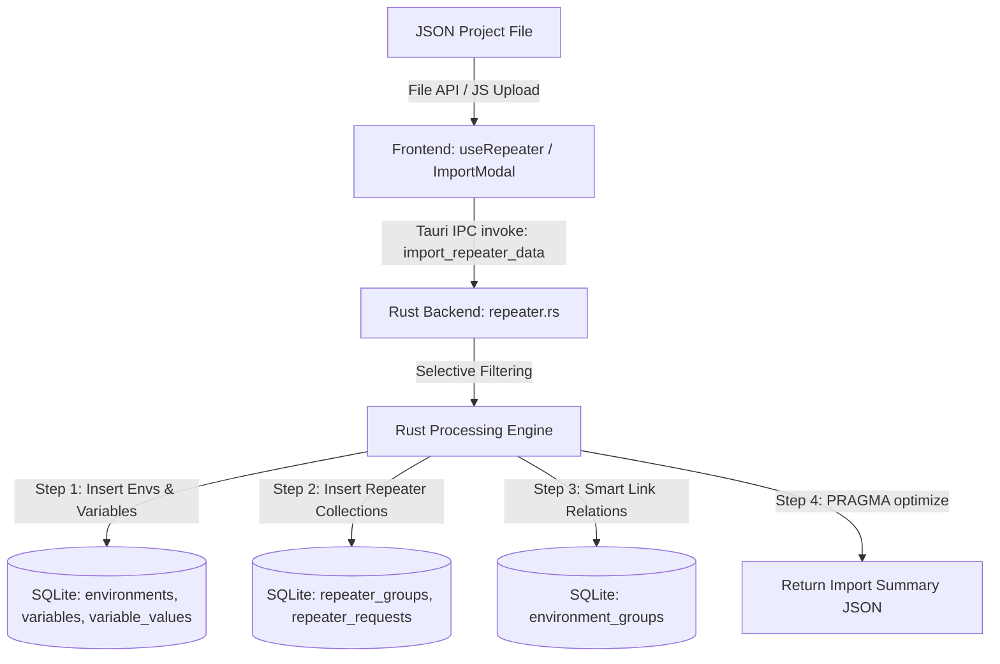

# Import Project from JSON Specification

This document provides a technical specification and operational guide for the **Import Project from JSON** functionality in MITM Rust. The backend logic is implemented in [`src-tauri/src/repeater.rs`]().

---

## Architecture Overview

The import system allows importing complete projects—including environments, variables, repeater request collections (groups), and endpoint targets—from a single structured JSON file into the local SQLite database.



---

## Best Practices: URL & Host Variable Templating (`{{host}}` / `{{url}}`)

To ensure clean separation between request definitions and environment configurations, **always use variable placeholders like `https://{{host}}` or `https://{{url}}`** for your base URLs instead of hardcoding absolute domains.

### Benefits of `https://{{host}}` or `https://{{url}}` Templating:
1. **Dynamic Environment Switching**: Seamlessly toggle between *Development*, *Staging*, and *Production* environments. The `{{host}}` or `{{url}}` placeholder dynamically resolves to the domain configured in the active environment.
2. **Clean Request Specifications**: Endpoint definitions remain clean and relative (e.g. `/v1/auth/login`), while protocols and server addresses are centrally managed via environment variables.

### Pattern Examples:
- **Full Base URL Variable**: `"url": "https://{{url}}"` (where `url` = `api.example.com` or `dev-api.example.com`)
- **Protocol + Host Variable**: `"url": "https://{{host}}/v1"` (where `host` = `api.example.com`)
- **Complete Endpoint with Variables**: `"url": "https://{{host}}", "endpoint": "/api/v1/users/{{userId}}"`

---

## Rust Struct & Data Contracts

The Rust backend in [`src-tauri/src/repeater.rs`]() defines the payload contract using `serde::Deserialize`:

```rust
#[derive(Debug, Deserialize, Serialize)]
pub struct ImportRepeaterData {
    pub name: Option<String>,
    pub url: Option<String>,
    pub header: Option<serde_json::Value>,
    pub placeholders: Option<serde_json::Value>,
    pub all_environments: Option<Vec<serde_json::Value>>,
    pub all_variables: Option<Vec<serde_json::Value>>,
    pub test_cases: Option<Vec<serde_json::Value>>,
    pub import_environments: Option<Vec<String>>,
    pub import_groups: Option<Vec<String>>,
    pub link_to_environment: Option<String>,
    pub link_to_environments: Option<Vec<String>>,
    pub smart_link: Option<bool>,
}
```

---

## JSON Format Specification

### Root Schema

| Field | Type | Required | Description |
| :--- | :--- | :--- | :--- |
| `name` | String | No | Project display name |
| `url` | String | No | Global base URL fallback (Best practice: `"https://{{url}}"` or `"https://{{host}}"`) |
| `header` | Object | No | Key-value dictionary of global HTTP headers |
| `placeholders` | Object | No | Key-value dictionary for simple variable fallbacks |
| `all_environments` | Array | No | List of environment definitions |
| `all_variables` | Array | No | List of environment variable definitions |
| `test_cases` | Array | No | List of repeater groups (collections) and request targets |
| `import_environments` | Array | No | Array of environment IDs or names selected for import |
| `import_groups` | Array | No | Array of group names selected for import |
| `link_to_environment` | String | No | Single target environment ID to link imported groups to (legacy) |
| `link_to_environments` | Array | No | Target environment IDs to link imported groups to |
| `smart_link` | Boolean | No | If `true`, automatically links imported groups to newly imported environments |

---

### Nested Schema Definitions

#### 1. `all_environments` Item
```json
{
  "id": "env_dev_001",
  "name": "Development"
}
```

#### 2. `all_variables` Item (Host & Token Variables)
```json
{
  "environmentId": "env_dev_001",
  "name": "host",
  "activeIndex": 0,
  "values": [
    {
      "name": "Dev Server",
      "value": "dev-api.example.com"
    },
    {
      "name": "Localhost",
      "value": "localhost:8080"
    }
  ]
}
```

#### 3. `test_cases` Item (Repeater Group with `https://{{host}}`)
```json
{
  "name": "Authentication API",
  "url": "https://{{host}}/v1",
  "target": [
    {
      "name": "Login Request",
      "method": "POST",
      "endpoint": "/auth/login",
      "params": {
        "grant_type": "password"
      },
      "header": {
        "Content-Type": "application/json",
        "Authorization": null
      },
      "body": "{\"username\":\"admin\",\"password\":\"secret\"}",
      "extract": {
        "token": "$.data.access_token"
      }
    }
  ]
}
```

#### 4. Multipart Form Data with Base64 Files in JSON Body
```json
{
  "name": "Upload Document",
  "method": "POST",
  "endpoint": "/files/upload",
  "header": {
    "Content-Type": "multipart/form-data"
  },
  "body": "{\"__form_data\":[{\"k\":\"file\",\"v\":\"data:application/pdf;base64,JVBERi0xLjQK...\",\"type\":\"base64\",\"fileName\":\"invoice.pdf\",\"contentType\":\"application/pdf\"}]}"
}
```

---

## Backend Processing Engine (`src-tauri/src/repeater.rs`)

### 1. Environments & Variables Ingestion

1. **Selective Filter**: An environment from `all_environments` is processed only if `import_environments` is empty/omitted OR contains the environment's `id` or `name`.
2. **Environment Insertion**:
   - A new UUID is generated for the environment in the database.
   - Inserted into `environments(id, name, is_active)` with `is_active = 0`.
3. **Variable Ingestion**:
   - Matches `all_variables` entries where `environmentId` equals the source environment `id`.
   - Generates new UUID for `variables(id, environment_id, name, active_index)`.
   - Iterates through `values` and inserts into `variable_values(id, variable_id, name, value)`.

### 2. Repeater Group & Request Ingestion

1. **Selective Filter**: A group from `test_cases` is imported only if `import_groups` is empty/omitted OR contains the group's `name`.
2. **Group Insertion**:
   - Generates new UUID for `repeater_groups(id, name, order_index)`.
3. **Environment Linking**:
   - Links group to environment IDs specified in `link_to_environments` / `link_to_environment`.
   - If `smart_link: true`, automatically adds links to newly created environment IDs.
   - Inserts records into `environment_groups(group_id, environment_id)`.
4. **URL Resolution Logic**:
   - Base URL precedence: `group.url` -> `global.url` -> `""`.
   - Concatenates `base_url` + `request.endpoint`.
   - Formats `params` as key-value query parameters (`?key1=val1&key2=val2`) and appends to URL.
   - Preserves `{{host}}` and `{{url}}` variable placeholders for runtime substitution by the active environment context.
5. **Header Resolution Logic**:
   - Starts with global `header` map.
   - Overrides or adds keys from request-level `header`.
   - If request header key maps to `null`, the header is **deleted/removed**.
6. **Request Insertion**:
   - Inserts into `repeater_requests(id, name, group_id, method, url, headers, body, extract, order_index)`.

---

## Returned Response Contract

On success, [`import_repeater_data`]() returns:

```json
{
  "success": true,
  "imported": {
    "environments": 2,
    "variables": 5,
    "groups": 3,
    "requests": 12
  }
}
```

---

## Complete Example JSON File (Best Practice Template)

Below is a production-grade sample project JSON file demonstrating best practices with `https://{{host}}` and `https://{{url}}` variable templating:

```json
{
  "name": "E-Commerce API Suite",
  "url": "https://{{host}}",
  "header": {
    "Accept": "application/json",
    "X-Client-ID": "mitm-desktop-app"
  },
  "all_environments": [
    {
      "id": "env_dev_001",
      "name": "Development"
    },
    {
      "id": "env_prod_001",
      "name": "Production"
    }
  ],
  "all_variables": [
    {
      "environmentId": "env_dev_001",
      "name": "host",
      "activeIndex": 0,
      "values": [
        {
          "name": "Dev Server",
          "value": "dev.api.store.com"
        },
        {
          "name": "Localhost",
          "value": "localhost:3000"
        }
      ]
    },
    {
      "environmentId": "env_dev_001",
      "name": "token",
      "activeIndex": 0,
      "values": [
        {
          "name": "Dev Token",
          "value": "dev_bearer_token_123"
        }
      ]
    },
    {
      "environmentId": "env_prod_001",
      "name": "host",
      "activeIndex": 0,
      "values": [
        {
          "name": "Production Gateway",
          "value": "api.store.com"
        }
      ]
    },
    {
      "environmentId": "env_prod_001",
      "name": "token",
      "activeIndex": 0,
      "values": [
        {
          "name": "Prod Token",
          "value": "prod_bearer_token_999"
        }
      ]
    }
  ],
  "test_cases": [
    {
      "name": "User Service",
      "url": "https://{{host}}/v1",
      "target": [
        {
          "name": "Get Profile",
          "method": "GET",
          "endpoint": "/profile",
          "params": {
            "include_meta": "true"
          },
          "header": {
            "Authorization": "Bearer {{token}}"
          },
          "body": "",
          "extract": {
            "userId": "$.user.id"
          }
        }
      ]
    },
    {
      "name": "Payment Gateway",
      "url": "https://{{url}}",
      "target": [
        {
          "name": "Process Payment",
          "method": "POST",
          "endpoint": "/checkout/pay",
          "header": {
            "Authorization": "Bearer {{token}}",
            "Content-Type": "application/json"
          },
          "body": "{\"amount\": 99.99, \"currency\": \"USD\"}",
          "extract": {
            "transactionId": "$.data.txn_id"
          }
        }
      ]
    }
  ]
}
```

---

## Database Table Mappings

| Entity | DB Table | Key Columns |
| :--- | :--- | :--- |
| Environment | `environments` | `id`, `name`, `is_active` |
| Variable | `variables` | `id`, `environment_id`, `name`, `active_index` |
| Variable Value | `variable_values` | `id`, `variable_id`, `name`, `value` |
| Repeater Group | `repeater_groups` | `id`, `name`, `order_index`, `extract` |
| Repeater Request | `repeater_requests` | `id`, `name`, `group_id`, `method`, `url`, `headers`, `body`, `extract`, `order_index` |
| Group Environment Link | `environment_groups` | `group_id`, `environment_id` |

---

